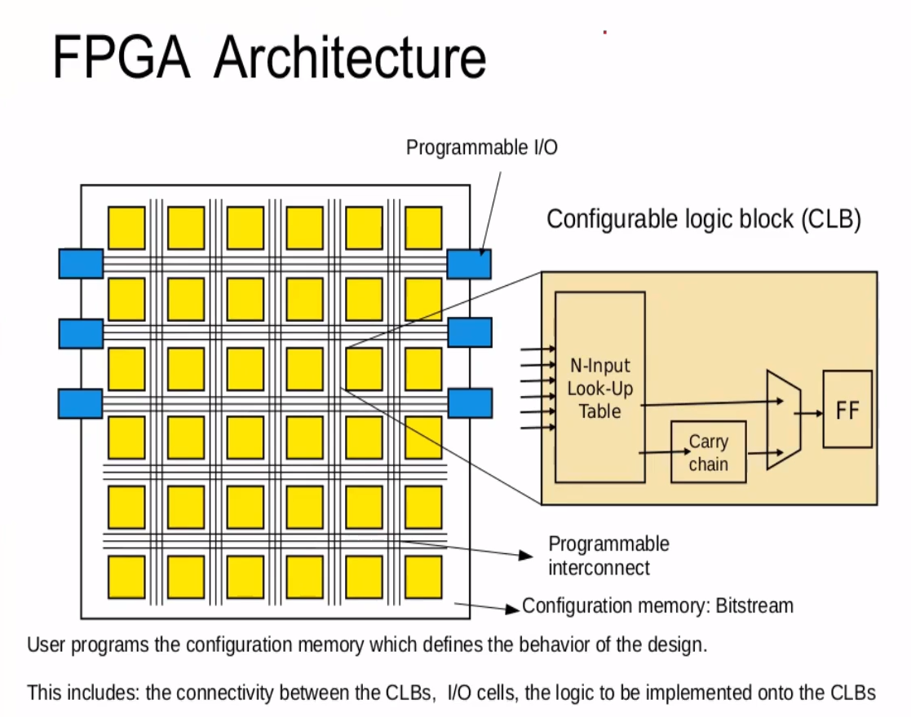

# FPGA Workshop
  This repository includes all the studies and the skills that have beed gained during the [FPGA-Fabric,Design and architecture](https://www.vlsisystemdesign.com/fpga/?utm_term=582784&utm_content=educational&utm_source=email-sendgrid&utm_medium=382714&utm_campaign=2022-12-05) workshop. that basicly covers 5 modules that will be mentioned in this repository

# Table of Contents
  - [Introduction To FPGA](#introduction-to-FPGA)
  - [Day 1 - Xilinx Vivado](#day-1---Xilinx-Vivado)
    - 
    - 
  - [Day 2 - ](#day-2---)
    - 
     
  - [Day 3 - ](#day-3---)
    
  - [Day 4 - ](#day-4---)
    
  - [Day 5 - ](#day-5---)
   
  - [References](#references)
  - [Acknowledgement](#acknowledgement)
 
# Introduction To FPGA
  FPGA or a field-programmable gate array is an integrated circuit designed to be configured by a designer . the FPGA configuration is specified by using a hardware description language (HDL) like (verilog ,etc.).
 the FPGA used in several firlds and application :
   - Hardware acceleration .
   - Signal processing .
   - Device controllers .
   - Embedded systems .
   - Aerosapce .
   - High performace computing .
   - Machine learning .
  FPGA Architeture .
    
 

  
# Day 1 - Xilinx Vivado

 
 
# Day 2 - 
 
 
# Day 3 - 

# Day 4 -

# Day 5 - 

  

   
# References
  - VLSI System Design: https://www.vlsisystemdesign.com/
 

# Acknowledgement
  - [Kunal Ghosh](https://github.com/kunalg123), Co-founder, VSD Corp. Pvt. Ltd.
  - [Nanditha Rao](https://github.com/nandithaec)
