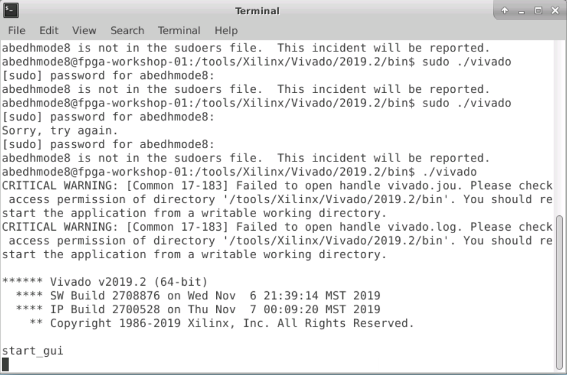
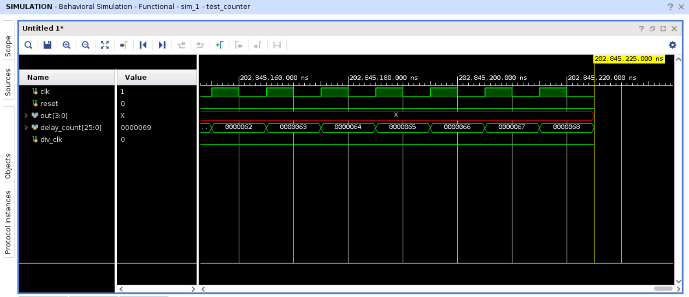
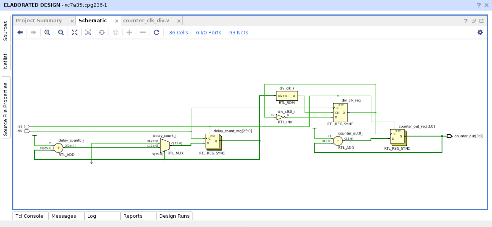
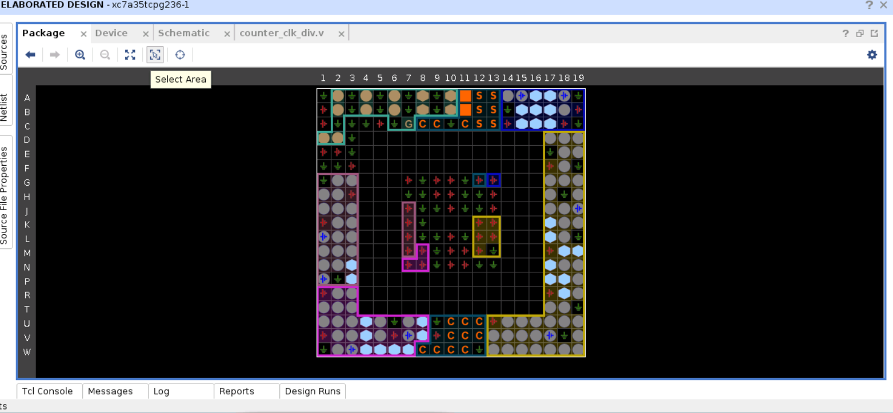
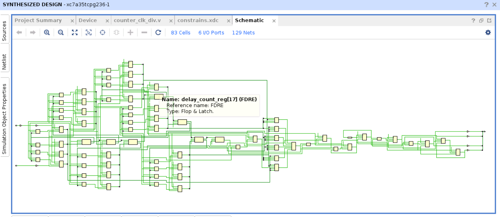
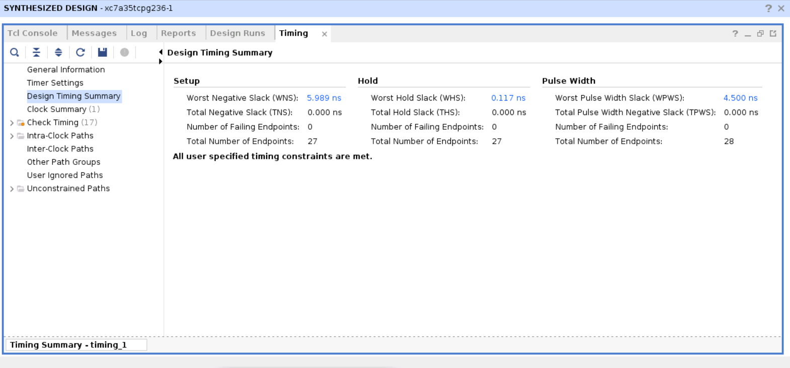
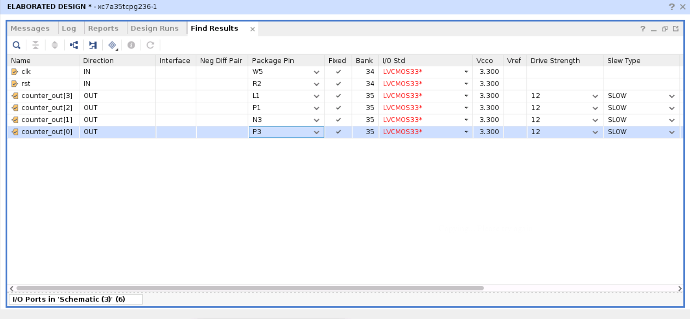
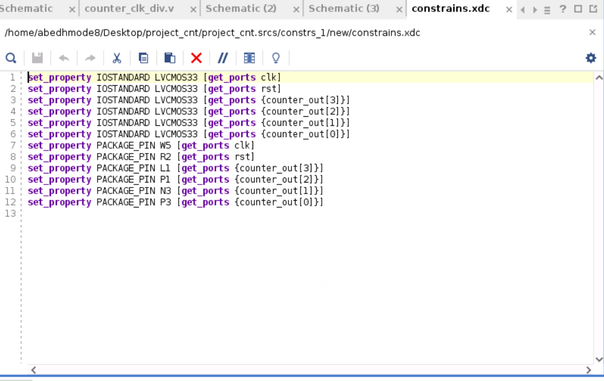
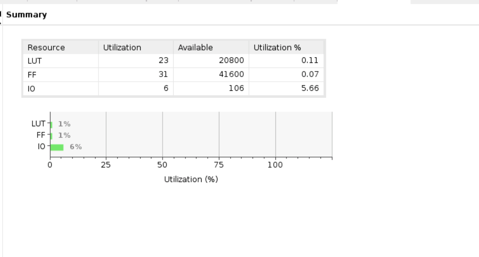
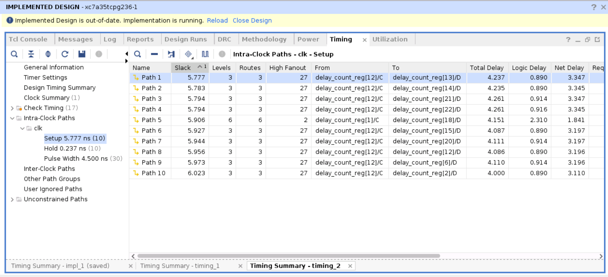

# FPGA Workshop
  This repository includes all the studies and the skills that have beed gained during the [FPGA-Fabric,Design and architecture](https://www.vlsisystemdesign.com/fpga/?utm_term=582784&utm_content=educational&utm_source=email-sendgrid&utm_medium=382714&utm_campaign=2022-12-05) workshop. that basicly covers 5 modules that will be mentioned in this repository. In this worksho we will be using the basys3 board as a FPGA hadrware .
  

# Table of Contents
  - [Introduction To FPGA](#introduction-to-FPGA)
  - [Day 1 - Xilinx Vivado](#day-1---Xilinx-Vivado)
    - 
    - 
  - [Day 2 - ](#day-2---)
    - 
     
  - [Day 3 - ](#day-3---)
    
  - [Day 4 - ](#day-4---)
    
  - [Day 5 - ](#day-5---)
   
  - [References](#references)
  - [Acknowledgement](#acknowledgement)
 
# Introduction To FPGA

  FPGA or a field-programmable gate array is an integrated circuit designed to be configured by a designer . the FPGA configuration is specified by using a hardware 
description language (HDL) like (verilog ,etc.).
the FPGA used in several firlds and application :
   - Hardware acceleration .
   - Signal processing .
   - Device controllers .
   - Embedded systems .
   - Aerosapce .
   - High performace computing .
   - Machine learning .
 
 FPGA Architeture .
    
 

  
# Day 1 - Xilinx Vivado

  ## Introduction To Vivado 
    Vivado is an platform that could be used to programe the basys3 board by using verilog  inital release was 2012 but in this work shop we will be using the version    of 2019.2 .
      Also this platform provides more metrics that we will mention below that can be essential for FPGA programing , in this workshop we will have a verilog code for    counter that already maden and we will run it .
      
   ### open Vivado 
   
        
    
   ## Vivado counter
       This repository was provided by a verilog code for a counter that could have be used to run it in vivado and simulate it and the results was :
       
       after run the simulation and make sure that every thing gone well we runing the elaborated design that will show us the schematic and the I/O planning of the FPGA that been used in the code .
       
       
       
       
       
       Next step is to run the synthesis that will be also providing us more complex schematic and I/O planning and displayes for us the timing analyses :
       
       
       
       
       for the next step we need to maked sure to change and match the I/O of the code to I/O that been defined in the basys3 borad  
               
               
               
               
        then we will run the implementaion :
        
               
               
         and that will gave us also a summray of the number of the logic blocks that used in the code and every path timing .
          
          
          
          
   ## Vivado VIO

   
      
  

 
 
# Day 2 - 
 
 
# Day 3 - 

# Day 4 -

# Day 5 - 

  

   
# References
  - VLSI System Design: https://www.vlsisystemdesign.com/
 

# Acknowledgement
  - [Kunal Ghosh](https://github.com/kunalg123), Co-founder, VSD Corp. Pvt. Ltd.
  - [Nanditha Rao](https://github.com/nandithaec)
